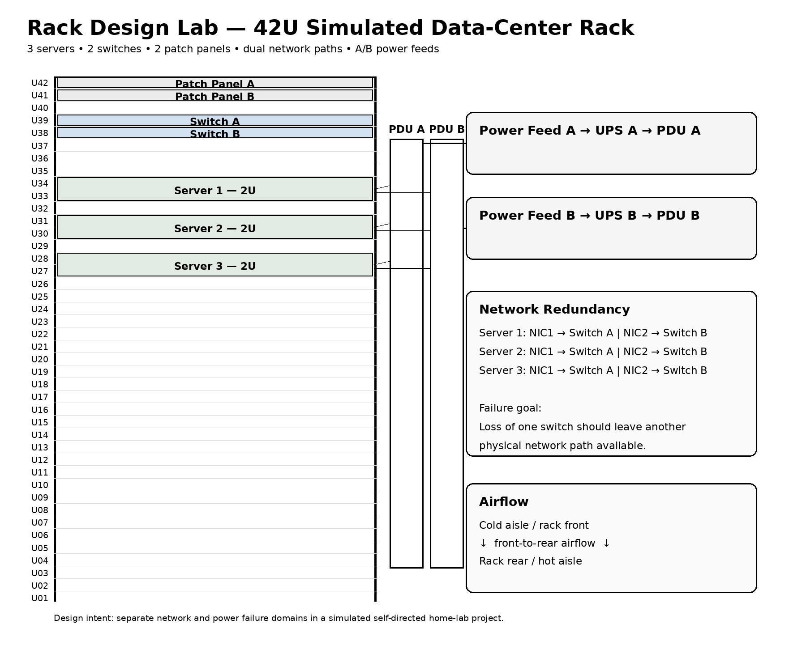
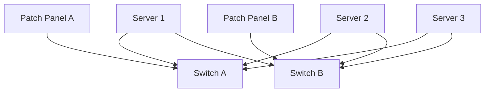
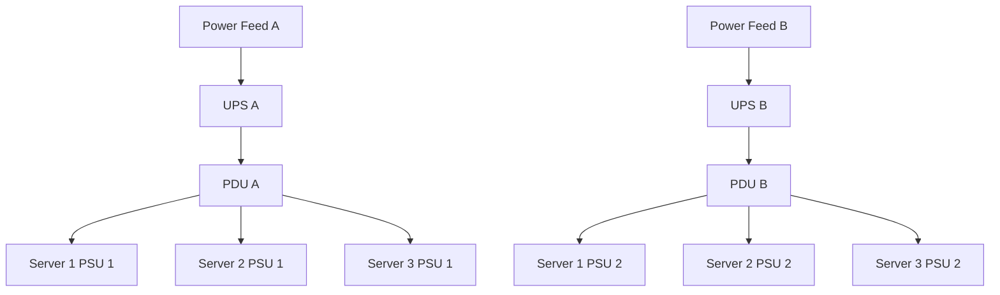
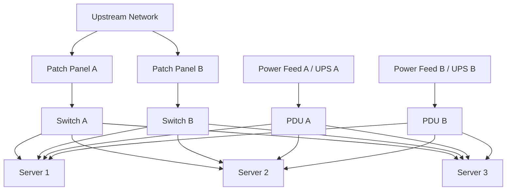

# Rack Design Lab

## Objective

Design a small simulated data-center rack containing:

- 3 rack servers
- 2 network switches
- 2 patch panels
- Redundant A/B power feeds
- Dual network paths
- Clear rack-unit allocation
- Front-to-rear airflow
- Basic failure-domain validation

This is a self-directed infrastructure design exercise intended to demonstrate understanding of rack layout, structured cabling, network redundancy, redundant power, airflow, and operational documentation.

> **Portfolio note:** This is a self-directed simulated home-lab project created for hands-on learning and portfolio demonstration.

---

## Repository Contents

```text
rack-design/
├── README.md
├── rack-diagram.png
├── assumptions.md
├── cabling-map.md
└── validation.md
```

---

## Rack Overview

Example rack size: **42U standard rack**



### Rack Unit Allocation

| Rack Unit | Equipment |
|---|---|
| U42 | Patch Panel A |
| U41 | Patch Panel B |
| U40 | Reserved / cable management |
| U39 | Switch A |
| U38 | Switch B |
| U37-U35 | Reserved / cable management |
| U34-U33 | Server 1 - 2U |
| U32 | Reserved |
| U31-U30 | Server 2 - 2U |
| U29 | Reserved |
| U28-U27 | Server 3 - 2U |
| U26-U01 | Reserved for future expansion |

---

## Network Design

Each server connects to both switches to provide two network paths.



### Server Network Connections

```text
Server 1
NIC 1 ───── Switch A
NIC 2 ───── Switch B

Server 2
NIC 1 ───── Switch A
NIC 2 ───── Switch B

Server 3
NIC 1 ───── Switch A
NIC 2 ───── Switch B
```

The design reduces the chance that a single switch failure will cause complete loss of server connectivity.

> Actual failover requires correct host and switch configuration, such as NIC bonding/teaming, LACP where appropriate, routing, or application-level redundancy. Physical dual cabling alone does not guarantee seamless failover.

---

## Power Design

The rack uses independent A and B power paths.



### Power Connections

```text
SERVER 1
PDU A ───── PSU 1
PDU B ───── PSU 2

SERVER 2
PDU A ───── PSU 1
PDU B ───── PSU 2

SERVER 3
PDU A ───── PSU 1
PDU B ───── PSU 2
```

This models **1+1 PSU redundancy**, assuming one PSU is capable of supporting the server's required load.

---

## Full Logical Rack Design



---

## Airflow Design

The design assumes standard front-to-rear server airflow.

```text
COLD AISLE
    ↓
Front of rack
    ↓
Servers / switches
    ↓
Rear of rack
    ↓
HOT AISLE
```

Equipment should be installed with consistent airflow direction. Blank rack spaces should ideally use blanking panels in a real deployment to reduce recirculation.

---

## Design Decisions

### Why place patch panels near the top?

Patch panels are located near the network switches to keep structured cabling organized and minimize unnecessary cable runs.

### Why use two switches?

Two switches provide separate network paths and reduce reliance on a single access switch.

### Why use two PDUs?

PDU A and PDU B create separate rack-level power paths.

### Why connect each PSU to a different PDU?

Connecting both server PSUs to the same PDU would leave that PDU as a single point of failure.

### Why reserve rack space?

Reserved rack units allow for future compute, storage, network, cable-management, or monitoring equipment.

---

## Skills Demonstrated

- Rack units and rack planning
- Rack server placement
- Patch panels
- Structured cabling
- Network redundancy
- Dual-switch architecture
- NIC path diversity
- Power redundancy
- 1+1 PSU redundancy
- A/B power feeds
- PDU and UPS concepts
- Front-to-rear airflow
- Cable labeling
- Failure-domain thinking
- Infrastructure documentation

---

## Validation Checklist

- [x] 3 servers included
- [x] 2 network switches included
- [x] 2 patch panels included
- [x] Each server has a path to Switch A
- [x] Each server has a path to Switch B
- [x] Each server has dual PSU connections
- [x] PSU 1 connects to PDU A
- [x] PSU 2 connects to PDU B
- [x] Separate A/B power paths documented
- [x] Airflow direction documented
- [x] Failure scenarios documented
- [x] Cable labeling scheme documented

See [validation.md](validation.md) for the detailed test plan.

---

## Lab Conclusion

This design demonstrates a small rack layout with basic network and power redundancy while preserving clear documentation and room for expansion.

The lab focuses on identifying and reducing single points of failure at the server, switch, PDU, and power-path levels. It also highlights an important operational principle: redundancy must exist both physically and logically to provide real resilience.

This is a self-directed simulated home-lab project for portfolio and study purposes.
