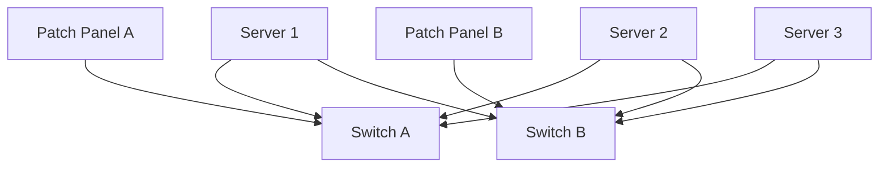
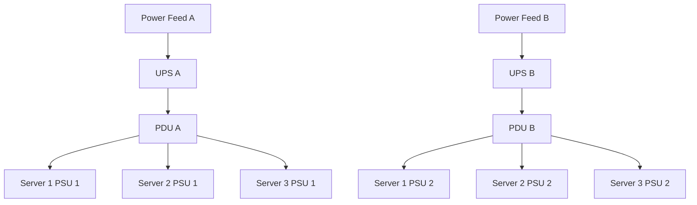
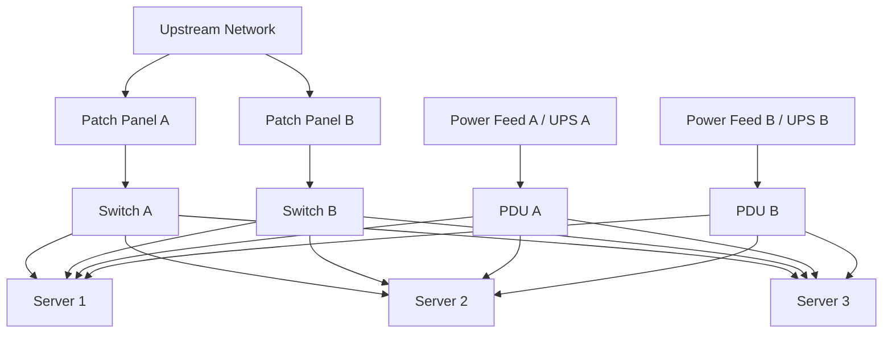

# Rack Design Lab

## Objective

Design a small data-center rack containing:

- 3 rack servers
- 2 network switches
- 2 patch panels
- Redundant A/B power feeds
- Dual network paths
- Clear rack-unit allocation

This lab is a self-directed infrastructure design exercise intended to demonstrate understanding of rack layout, server placement, network redundancy, structured cabling, and redundant power design.

---

# Rack Overview

Example rack size:

**42U standard rack**

```text
FRONT VIEW

U42  ┌──────────────────────────────┐
U41  │ Patch Panel A                │
U40  │ Patch Panel B                │
U39  ├──────────────────────────────┤
U38  │ Switch A                     │
U37  │ Switch B                     │
U36  ├──────────────────────────────┤
U35  │                              │
U34  │ Server 1 - 2U                │
U33  │ Server 1                     │
U32  ├──────────────────────────────┤
U31  │ Server 2 - 2U                │
U30  │ Server 2                     │
U29  ├──────────────────────────────┤
U28  │ Server 3 - 2U                │
U27  │ Server 3                     │
U26  ├──────────────────────────────┤
U25  │                              │
U24  │ Reserved for expansion       │
U23  │ Reserved for expansion       │
U22  │                              │
U21  │                              │
U20  │                              │
U19  │                              │
U18  │                              │
U17  │                              │
U16  │                              │
U15  │                              │
U14  │                              │
U13  │                              │
U12  │                              │
U11  │                              │
U10  │                              │
U09  │                              │
U08  │                              │
U07  │                              │
U06  │                              │
U05  │                              │
U04  │                              │
U03  │                              │
U02  │                              │
U01  │                              │
      └──────────────────────────────┘
```

---

# Network Design

Each server connects to both switches for redundancy.



Each server has two network interfaces:

```text
Server 1
NIC 1 ───── Switch A
NIC 2 ───── Switch B

Server 2
NIC 1 ───── Switch A
NIC 2 ───── Switch B

Server 3
NIC 1 ───── Switch A
NIC 2 ───── Switch B
```

This avoids a single switch becoming a single point of failure.

If Switch A fails, servers should still have connectivity through Switch B.

---

# Power Design

The rack uses separate A and B power paths.



Power connections:

```text
                SERVER 1
             ┌─────────────┐
PDU A ──────►│ PSU 1       │
PDU B ──────►│ PSU 2       │
             └─────────────┘

                SERVER 2
             ┌─────────────┐
PDU A ──────►│ PSU 1       │
PDU B ──────►│ PSU 2       │
             └─────────────┘

                SERVER 3
             ┌─────────────┐
PDU A ──────►│ PSU 1       │
PDU B ──────►│ PSU 2       │
             └─────────────┘
```

This is an example of **1+1 PSU redundancy** where one PSU is sufficient to keep the server operational.

---

# Full Logical Rack Design



---

# Cabling Plan

| Device | Port | Connected To | Purpose |
|---|---|---|---|
| Server 1 | NIC 1 | Switch A | Primary network path |
| Server 1 | NIC 2 | Switch B | Redundant network path |
| Server 2 | NIC 1 | Switch A | Primary network path |
| Server 2 | NIC 2 | Switch B | Redundant network path |
| Server 3 | NIC 1 | Switch A | Primary network path |
| Server 3 | NIC 2 | Switch B | Redundant network path |
| Server 1 | PSU 1 | PDU A | Power Feed A |
| Server 1 | PSU 2 | PDU B | Power Feed B |
| Server 2 | PSU 1 | PDU A | Power Feed A |
| Server 2 | PSU 2 | PDU B | Power Feed B |
| Server 3 | PSU 1 | PDU A | Power Feed A |
| Server 3 | PSU 2 | PDU B | Power Feed B |

---

# Cable Labeling

Example cable labels:

```text
Network

SRV01-NIC1-SWA
SRV01-NIC2-SWB

SRV02-NIC1-SWA
SRV02-NIC2-SWB

SRV03-NIC1-SWA
SRV03-NIC2-SWB
```

Power cables:

```text
SRV01-PSU1-PDUA
SRV01-PSU2-PDUB

SRV02-PSU1-PDUA
SRV02-PSU2-PDUB

SRV03-PSU1-PDUA
SRV03-PSU2-PDUB
```

---

# Airflow Design

Standard server airflow:

```text
COLD AISLE

      ↓ Cold air

┌───────────────────────┐
│ FRONT OF RACK         │
│                       │
│ Servers               │
│ Switches              │
│                       │
└───────────────────────┘

      ↓ Air passes
        through equipment

┌───────────────────────┐
│ REAR OF RACK          │
└───────────────────────┘

      ↓ Hot exhaust

HOT AISLE
```

Equipment should be installed so that airflow direction is consistent.

Most servers use:

**Front-to-rear airflow**

---

# Failure Scenarios

## Scenario 1 — Switch A Failure

```text
Switch A ✖

Server 1 ── NIC 2 ── Switch B ✓
Server 2 ── NIC 2 ── Switch B ✓
Server 3 ── NIC 2 ── Switch B ✓
```

Expected result:

Servers retain network connectivity through Switch B.

---

## Scenario 2 — PDU A Failure

```text
PDU A ✖

Server 1 PSU 2 ── PDU B ✓
Server 2 PSU 2 ── PDU B ✓
Server 3 PSU 2 ── PDU B ✓
```

Expected result:

Servers continue running on Power Feed B.

---

## Scenario 3 — Server PSU Failure

Example:

```text
Server 2

PSU 1 ✖
PSU 2 ✓
```

Expected result:

Server 2 continues operating.

---

# Design Decisions

### Why place patch panels near the top?

Patch panels are placed near the switches to reduce cable length and keep structured cabling organized.

### Why use two switches?

Two switches provide network redundancy and reduce the risk of one switch becoming a single point of failure.

### Why use two PDUs?

PDU A and PDU B provide independent power paths.

### Why connect each PSU to a different PDU?

Connecting both PSUs to the same PDU would leave the PDU as a single point of failure.

### Why reserve rack space?

Unused rack units provide room for future servers, storage appliances, additional switches, or other infrastructure.

---

# Skills Demonstrated

This lab demonstrates understanding of:

- Rack units
- Rack server placement
- Patch panels
- Structured cabling
- Network redundancy
- Dual-switch architecture
- NIC redundancy
- Power redundancy
- 1+1 PSU redundancy
- A/B power feeds
- PDUs
- UPS concepts
- Server airflow
- Hot aisle / cold aisle
- Cable labeling
- Failure-domain thinking
- Basic data-center infrastructure documentation

---

# Validation Checklist

- [x] 3 servers included
- [x] 2 network switches included
- [x] 2 patch panels included
- [x] Each server connects to Switch A
- [x] Each server connects to Switch B
- [x] Each server has redundant PSU connections
- [x] PSU 1 connects to PDU A
- [x] PSU 2 connects to PDU B
- [x] Separate A/B power paths documented
- [x] Airflow direction documented
- [x] Failure scenarios documented
- [x] Cable labeling scheme documented

---

## Lab Conclusion

This design provides basic network and power redundancy while maintaining a clear rack layout.

The exercise demonstrates how multiple failure domains can be considered when designing rack infrastructure. A single PSU, PDU, power feed, network interface, or switch failure should not automatically cause complete server loss, assuming the redundant components and network configuration are functioning correctly.

This is a simulated home-lab design.
